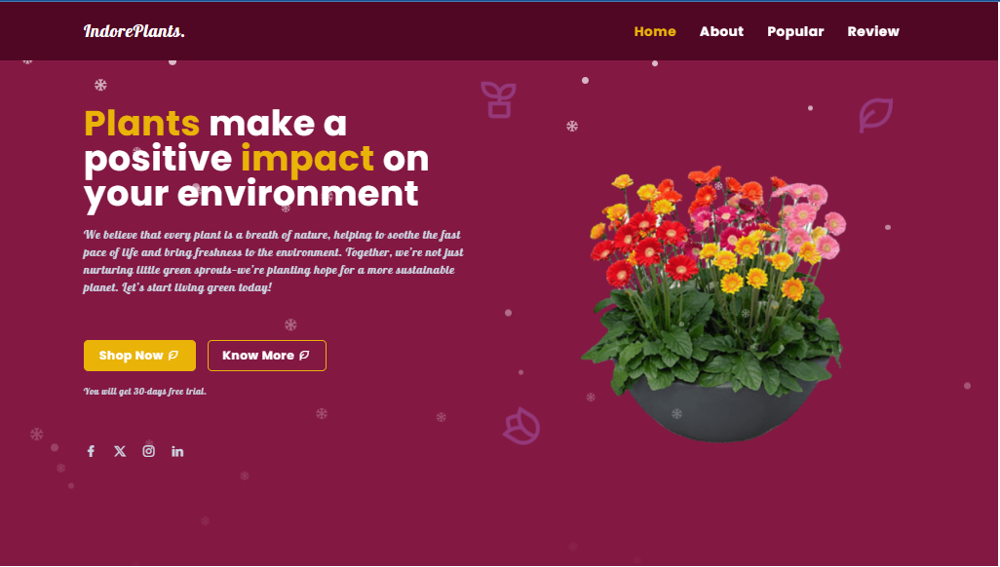

### 💡 This is Project #1 in my Tailwind learning series.

## 🌿 IndoorPlants 
A simple and responsive landing page for a plant shop, built using **TailwindCSS**.
This project is part of my learning journey to practice Tailwind utility-first CSS framework.

## 🚀 Features
- Fully responsive layout (mobile-first)
- Animated icons and buttons
- Clean and modern design
- Navigation bar with hamburger menu
- Sectioned structure: Home, About, Popular, Review.

## 📸 Preview
# 🌿 Home Page


# 🪴 About Page


# 📦 Cart Page


## 🧾 How to Use
<!-- # 🛠️ Setup TailwindCSS using CLI
### 1. Create the project folder and initialize npm
```bash
    mkdir tailwind-IndorePlants
    cd tailwind-IndorePlants
    npm init -y
```
### 2.  Install TailwindCSS (v3.4.17)
⚡  Detailed documentation: [v3.tailwindcss.com](https://v3.tailwindcss.com/docs/) -->


## 📚 Lessons Learned
- Responsive design with Tailwind classes
- Mobile-first layout
- Custom animations using Tailwind utilities
- Better understanding of layout utilities (flex, grid, spacing, etc.)

## 🧑‍💻 Author
- GitHub: [thanhphucnguyen](https://github.com/thanhphucnguyen-dev)

---
```markdown
##  🤝 Contributing
This is a beginner project for learning purposes. Suggestions and improvements are welcome!
## 📜 License
This project is open source and free to use for educational purposes.