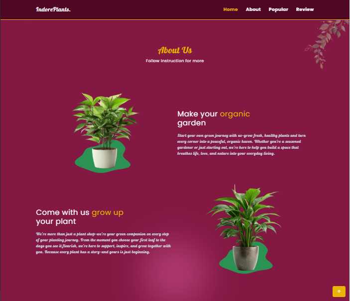

### 💡 This is Project #1 in my Tailwind learning series.

## 🌿 IndoorPlants

A simple and responsive landing page for a plant shop, built using **TailwindCSS**.
This project is part of my learning journey to practice Tailwind utility-first CSS framework.

## 🚀 Features

- Fully responsive layout (mobile-first)
- Animated icons and buttons
- Clean and modern design
- Navigation bar with hamburger menu
- Sectioned structure: Home, About, Popular, Review.

## 📸 Preview

# 🌿 Home


# 🪴 About



# 📦 Card


# ✨ Review


# Video preview

<video width="600" controls>
  <source src="/assets/img/Preview.mp4" type="video/mp4">
</video>

<video width="600" controls>
  <source src="/assets/img/Preview_responsive.mp4" type="video/mp4">
</video>


## 📚 Lessons Learned

- Responsive design with Tailwind classes
- Mobile-first layout
- Custom animations using Tailwind utilities
- Better understanding of layout utilities (flex, grid, spacing, etc.)

## 🧑‍💻 Author

- GitHub: [thanhphucnguyen](https://github.com/thanhphucnguyen-dev)

---

```markdown
## 🤝 Contributing

This is a beginner project for learning purposes. Suggestions and improvements are welcome!

## 📜 License

This project is open source and free to use for educational purposes.
```
